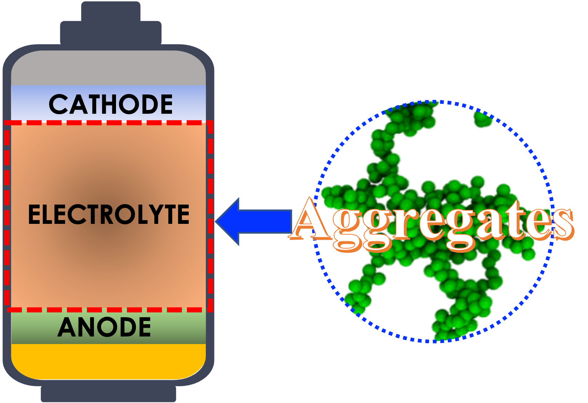

**Represetative Peer Reviewed Journal Papers** (**#equal contribution**)

**Full publications** are summarized in [**google scholar**](https://scholar.google.com/citations?hl=en&user=vdyQoyoAAAAJ&view_op=list_works&sortby=pubdate)

(18)	**Yu, Z.#**; Shi, Z.#; Bheemireddy, S. R.; Qian, K.; Li, T.; Zhang, L.; Cheng, L.; Molecular Designing and Characterizing of Novel Fluorinated Ether Solvent for Li Metal Battery. (In preparation)

(17)	Mistry, A.; **Yu, Z.**; Peters, B. L.; Fang, C.; Wang, R.; Curtiss, L. A.; Balsara, N. P.; Cheng, L.; Srinivasan, V.; Toward Bottom-up Understanding of Transport in Concentrated Battery electrolytes, ACS Central Science 2022 (Under review)

(16)	**Yu, Z.**; Balsara, N. P.; Borodin, O.; Gewirth, A. A.; Hahn, N. T.; Maginn, E. J.; Persson, K.; Srinivasan, V.; Toney, M. F.; Xu, K.; Zavadil, K.; Curtiss, L. A.; Cheng, L., Beyond Local Solvation Structure:  Nanometric Aggregates in Battery Electrolytes and their Effect on Electrolyte Properties. ACS Energy Letters 2022, 7, 461-470. [LINK](https://pubs.acs.org/doi/10.1021/acsenergylett.1c02391)

  
(15)	Qian, K.#; **Yu, Z.#**; Liu, Y.; Gosztola, D. J.; Winans, R. E.; Cheng, L.; Li, T., Understanding Fluorine-Free Electrolytes via Small-Angle X-Ray Scattering. Journal of Energy Chemistry 2022, 70, 340-346. [LINK](https://www.sciencedirect.com/science/article/pii/S2095495622001127) 

(14)	Wen, X.; **Yu, Z.**; Zhao, Y.; Zhang, J.; Qiao, R.; Cheng, L.; Ban, C.; Guo, J., Enabling Magnesium Anodes by Tuning the Electrode/Electrolyte Interfacial Structure. ACS Applied Materials & Interfaces 2021, 13, 52461-52468. [LINK](https://pubs.acs.org/doi/abs/10.1021/acsami.1c10446)

(13)	**Yu, Z.**; Juran, T. R.; Liu, X.; Han, K. S.; Wang, H.; Mueller, K. T.; Li, T.; Curtiss, L. A.; Cheng, L., Solvation Structure and Dynamics of Mg(TFSI)2 Aqueous Electrolyte. Energy & Environmental Materials 2021, 0, 1-10. [LINK](https://onlinelibrary.wiley.com/doi/full/10.1002/eem2.12174)

(12)	Zhao, C.; Xu, G.-L.; **Yu, Z.**; Zhang, L.; Huang, I.; Mo, Y.-X.; Ren, Y.; Cheng, L.; Sun, C.-J.; Ren, Y.; Zuo, X.; Li, J.-T.; Sun, S.-G.; Amine, K.; Zhao, T., A High-Energy and Long-Cycling Lithium-Sulfur Pouch Cell via a Macroporous Catalytic Cathode with Double-End Binding Sites. Nature Nanotechnology 2021, 16, 166-173. [LINK](https://www.nature.com/articles/s41565-020-00797-w)

(11)	Zhao, Y.#; **Yu, Z.#**; Robertson, L. A.; Zhang, J.; Shi, Z.; Bheemireddy, S. R.; Shkrob, I. A.; Li, T.; Zhang, Z.; Cheng, L.; Zhang, L., Unexpected Electrochemical Behavior of an Anolyte Redoxmer in Flow Battery Electrolytes: Solvating Cations Help to Fight against the Thermodynamic–Kinetic Dilemma. Journal of Materials Chemistry A 2020, 8, 13470-13479. [LINK](https://pubs.rsc.org/en/content/articlelanding/2020/ta/d0ta02214d)

(10)	**Yu, Z.**; Curtiss, L. A.; Winans, R. E.; Zhang, Y.; Li, T.; Cheng, L., Asymmetric Composition of Ionic Aggregates and the Origin of High Correlated Transference Number in Water-in-Salt Electrolytes. The Journal of Physical Chemistry Letters 2020, 11, 1276-1281. [LINK](https://pubs.acs.org/doi/abs/10.1021/acs.jpclett.9b03495)

(9)	Hahn, N. T.; Driscoll, D. M.; **Yu, Z.**; Sterbinsky, G. E.; Cheng, L.; Balasubramanian, M.; Zavadil, K. R., The Influence of Ether Solvent and Anion Coordination on Electrochemical Behavior in Calcium Battery Electrolytes. ACS Applied Energy Materials 2020, 3, 8337-8447. [LINK](https://pubs.acs.org/doi/10.1021/acsaem.0c01070)

(8)	Wang, Y.; He, Y.; **Yu, Z.**; Gao, J.; Ten Brinck, S.; Slebodnick, C.; Fahs, G. B.; Zanelotti, C. J.; Hegde, M.; Moore, R. B.; Ensing, B.; Dingemans, T. J.; Qiao, R.; Madsen, L. A., Double Helical Conformation and Extreme Rigidity in a Rodlike Polyelectrolyte. Nature Communications 2019, 10, 1-8. [LINK](https://www.nature.com/articles/s41467-019-08756-3)

(7)	Jiang, Z.-L.; Xu, G.-L.; **Yu, Z.**; Zhou, T.-H.; Shi, W.-K.; Luo, C.-S.; Zhou, H.-J.; Chen, L.-B.; Sheng, W.-J.; Zhou, M.; Cheng, L.; Assary, R. S.; Sun, S.-G.; Amine, K.; Sun, H., High Rate and Long Cycle Life in Li-O2 Batteries with Highly Efficient Catalytic Cathode Configured with Co3O4 Nanoflower. Nano Energy 2019, 64, 103896. [LINK](https://www.sciencedirect.com/science/article/pii/S2211285519306032)

(6)	**Yu, Z.**; Yang, F.; Dai, S.; Qiao, R., Structure and Dynamics of Polymeric Canopies in Nanoscale Ionic Materials: An Electrical Double Layer Perspective. Scientific Reports 2018, 8, 1-11. [LINK](https://www.nature.com/articles/s41598-018-23493-1)

(5)	**Yu, Z.**; Fang, C.; Huang, J.; Sumpter, B. G.; Qiao, R., Solvate Ionic Liquids at Electrified Interfaces. ACS Applied Materials & Interfaces 2018, 10, 32151-32161. [LINK](https://pubs.acs.org/doi/10.1021/acsami.8b10387)

(4)	**Yu, Z.**; Fang, C.; Huang, J.; Sumpter, B. G.; Qiao, R., Molecular Structure and Dynamics of Interfacial Polymerized Ionic Liquids. The Journal of Physical Chemistry C 2018, 122, 22494-22503. [LINK](https://pubs.acs.org/doi/10.1021/acs.jpcc.8b06065)

(3)	**Yu, Z.**; Zhang, F.; Huang, J.; Sumpter, B. G.; Qiao, R., Ionic Liquids-Mediated Interactions between Nanorods. The Journal of Chemical Physics 2017, 147, 134704. [LINK](https://aip.scitation.org/doi/10.1063/1.5005541)

(2) Fang, C.; **Yu, Z.**; Qiao, R., Impact of Surface Ionization on Water Transport and Salt Leakage through Graphene Oxide Membranes. The Journal of Physical Chemistry C 2017, 121, 13412-13420. [LINK](https://pubs.acs.org/doi/10.1021/acs.jpcc.7b04283)

(1) **Yu, Z.**; He, Y.; Wang, Y.; Madsen, L. A.; Qiao, R., Molecular Structure and Dynamics of Ionic Liquids in a Rigid-Rod Polyanion-Based Ion Gel. Langmuir 2017, 33, 322-331. [LINK](https://pubs.acs.org/doi/abs/10.1021/acs.langmuir.6b03798)

Book Chapter

(1)	**Yu, Z.**; Qiao, R., “Ionic Liquids in Molecular Composites” in “Encyclopedia of Ionic Liquids”, edited by Suojiang Zhang, Elsevier, 2020.

